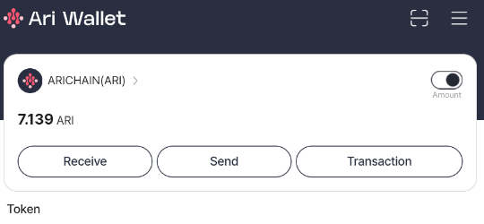

# Arichain 自动推荐机器人


- 官网: https://arichain.io/

## 功能特性

- **自动注册**
- **自动保存账户**
- **支持代理使用**

## 环境要求

- 已安装 Node.js
- Arichain 邀请码：
- 先在Google Play商店下载apk [arichain.app.ari.wallet](https://play.google.com/store/apps/details?id=arichain.app.ari.wallet)

- 复制你的推荐码

   

- 如果使用注册邀请码，可以白嫖50ARI（签到一次10ARI）：
    ```
    678d2dda4f671
    ```

## 操作步骤

1. 克隆仓库：
    ```sh
    git clone https://github.com/0xbaiwan/arichain_bot
    cd arichain_bot
    ```

2. 安装依赖：
    ```sh
    npm install
    ```

3. 可选使用代理：
- 将代理粘贴到 `proxy.txt` 中，格式为 `http://用户名:密码@ip:端口`
    ```sh
    nano proxy.txt
    ```

4. 运行脚本：
    ```sh
    npm run start
    ```

 所有账户信息保存在 `accounts.txt` 中

## 保持会话在后台运行（可选）
1. 运行 `screen` 建立新会话窗口；
2. 运行脚本；
3. 成功后， 按 ctrl+A+D 分离会话，此时会话就会在后台运行；
4. 重命名会话。首先 `screen -ls` 查看所有会话列表，找到想要重命名的会话id，如17170，运行 `screen -S 17170 -X sessionname new_name(新名字）`；
5. 运行 `screen -ls` 看看名称是不是变更成功；

## 购买代理（可选）

- 免费静态住宅代理：
   - [WebShare](https://www.webshare.io/?referral_code=gtw7lwqqelgu)
   - [ProxyScrape](https://proxyscrape.com/)
   - [MonoSans](https://github.com/monosans/proxy-list)
- 付费高级静态住宅代理：
   - [922proxy](https://www.922proxy.com/register?inviter_code=d6416857)
   - [Proxy-Cheap](https://app.proxy-cheap.com/r/Pd6sqg)
   - [Infatica](https://dashboard.infatica.io/aff.php?aff=580)
- 付费动态IP代理
   - [IPRoyal](https://iproyal.com/?r=733417)
