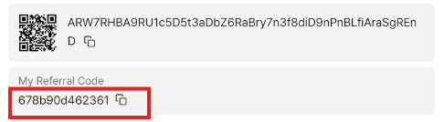

# Arichain 自动推荐系统


- 官网: https://arichain.io/

## 功能特性

- **自动注册**
- **自动保存账户**
- **支持代理使用**

## 环境要求

- 已安装 Node.js
- Arichain 邀请码：
- 先在Google Play商店下载apk [arichain.app.ari.wallet](https://play.google.com/store/apps/details?id=arichain.app.ari.wallet)

- 复制你的推荐码

    

- 如果需要注册邀请码，可以使用我的：
    ```
    678b90d462361
    ```

## 安装步骤

1. 克隆仓库：
    ```sh
    git clone https://github.com/0xbaiwan/arichain_bot
    cd arichain
    ```

2. 安装依赖：
    ```sh
    npm install
    ```

3. 可选使用代理：
- 将代理粘贴到 `proxy.txt` 中，格式为 `http://用户名:密码@ip:端口`
    ```sh
    nano proxy.txt
    ```

4. 运行脚本：
    ```sh
    npm run start
    ```

 所有账户信息保存在 `accounts.txt` 中

## 购买代理（可选）

- 免费静态住宅代理：
   - [WebShare](https://www.webshare.io/?referral_code=gtw7lwqqelgu)
   - [ProxyScrape](https://proxyscrape.com/)
   - [MonoSans](https://github.com/monosans/proxy-list)
- 付费高级静态住宅代理：
   - [922proxy](https://www.922proxy.com/register?inviter_code=d6416857)
   - [Proxy-Cheap](https://app.proxy-cheap.com/r/Pd6sqg)
   - [Infatica](https://dashboard.infatica.io/aff.php?aff=580)
